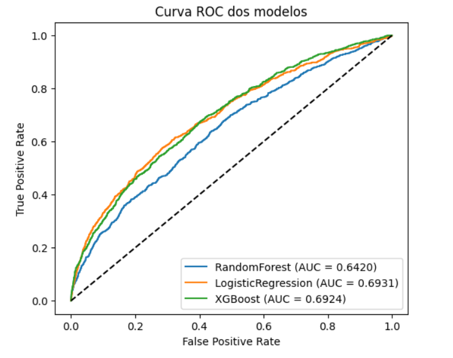

# Previsão de Probabilidade de Acidentes com Aprendizado de Máquina

Trabalho de Conclusão de Curso da Especialização em Inteligência Artificial e Ciência de Dados (UFES / UnAC).

- **Aluno:** Frederico Luiz Strey
- **Orientador:** Prof. Ph.D. Alexandre Loureiros Rodrigues
- **Artigo completo:** [TCC Ciência de Dados.pdf](TCC%20Ci%C3%AAncia%20de%20Dados.pdf)

## Sobre o projeto

O TCC foi desenvolvido no formato de uma competição no Kaggle (**Competição TCC IA 2025**), com dados anonimizados de uma seguradora de veículos. A tarefa é treinar um modelo que estime o risco de acidente: para cada condutor em uma janela de tempo, prever a probabilidade de ocorrer um acidente na janela seguinte.

É um problema de classificação binária bastante desbalanceado (5.490 acidentes em 368.734 registros de treino, cerca de 1,5%), avaliado pela **área sob a curva ROC (AUC)**, métrica oficial da competição.

## Dados

Cada linha representa um condutor em uma janela de tempo, com um `id`, o `target` binário (houve ou não acidente na janela seguinte) e 157 variáveis explicativas. Os dados já foram entregues pré-processados e anonimizados pela organização, então os nomes das variáveis não revelam diretamente o seu significado, apenas o grupo a que pertencem:

| Prefixo | Grupo |
|---|---|
| `cd` | Comportamento de direção (telemetria do veículo em movimento) |
| `temp` | Características temporais do período observado |
| `dem` | Características demográficas do condutor ou do contrato |
| `regiao` | Características das regiões de circulação do veículo |
| `hist` | Histórico de eventos anteriores do condutor ou do veículo |

O sufixo `prep` indica que a variável passou por algum pré-processamento (normalização, padronização ou codificação categórica).

A competição fornece três arquivos, que **não estão neste repositório**:

- `base_treinamento.csv`: features e `target`
- `base_teste.csv`: mesmas features, sem o `target`
- `exemplo_submissao.csv`: modelo do arquivo de submissão

## Metodologia

Foram comparados três algoritmos: **Regressão Logística**, **Random Forest** e **XGBoost**.

1. **Comparação inicial** ([teste-modelos.ipynb](teste-modelos.ipynb)): os três modelos com hiperparâmetros básicos, combinados com quatro estratégias de balanceamento de classes (sem balanceamento, Random UnderSampling, Random OverSampling e SMOTE, da biblioteca `imbalanced-learn`), avaliados com validação cruzada estratificada em 5 folds.
2. **Primeira busca de hiperparâmetros** ([teste-modelos.ipynb](teste-modelos.ipynb)): `GridSearchCV` no XGBoost com uma grade enxuta (48 combinações, 3 folds) e PCA com 70 componentes.
3. **Otimização dos três modelos** com `RandomizedSearchCV`, validação cruzada estratificada em 3 folds e AUC ROC como critério, seguida de uma segunda rodada de ajuste fino do XGBoost em GPU, com intervalos de busca ampliados.
4. **Treino final** ([treino-otimizado.ipynb](treino-otimizado.ipynb)): os três modelos com os melhores hiperparâmetros encontrados e geração da submissão.

Os modelos finais usam o mesmo pipeline:

- `SimpleImputer(strategy='median')` para valores faltantes
- `StandardScaler` para padronização
- PCA opcional (a busca escolheu `passthrough`, ou seja, sem redução de dimensionalidade, nos três modelos)

## Resultados

### Efeito do balanceamento

Resultados da comparação inicial em [teste-modelos.ipynb](teste-modelos.ipynb), ordenados por AUC (validação cruzada estratificada em 5 folds):

| Modelo | Balanceamento | AUC | Acurácia | Precisão | Recall | F1 |
|---|---|---|---|---|---|---|
| Regressão Logística | Nenhum | 0,6639 | 0,9850 | 0,1515 | 0,0009 | 0,0018 |
| Regressão Logística | RandomOverSampler | 0,6632 | 0,6552 | 0,0251 | 0,5852 | 0,0481 |
| Regressão Logística | RandomUnderSampler | 0,6577 | 0,6422 | 0,0243 | 0,5883 | 0,0467 |
| XGBoost | Nenhum* | 0,6570 | 0,7888 | 0,0305 | 0,4277 | 0,0569 |
| Regressão Logística | SMOTE | 0,6545 | 0,6353 | 0,0239 | 0,5898 | 0,0459 |
| Random Forest | RandomUnderSampler | 0,6389 | 0,6561 | 0,0233 | 0,5397 | 0,0446 |
| Random Forest | Nenhum | 0,6332 | 0,9851 | 0,0000 | 0,0000 | 0,0000 |
| Random Forest | RandomOverSampler | 0,6330 | 0,8950 | 0,0348 | 0,2262 | 0,0603 |
| XGBoost | RandomUnderSampler* | 0,6202 | 0,0261 | 0,0150 | 0,9944 | 0,0295 |
| XGBoost | SMOTE* | 0,5885 | 0,3473 | 0,0171 | 0,7576 | 0,0334 |
| XGBoost | RandomOverSampler* | 0,5711 | 0,0658 | 0,0150 | 0,9546 | 0,0295 |
| Random Forest | SMOTE | 0,5672 | 0,9143 | 0,0236 | 0,1175 | 0,0392 |

\* O XGBoost usa ponderação de classes (`scale_pos_weight` ≈ 66) em todas as execuções. O peso é definido na execução sem reamostragem e permanece ativo nas seguintes, de modo que as linhas com reamostragem acumulam os dois ajustes.

Sem balanceamento, Regressão Logística e Random Forest atingem acurácia de 0,985 com recall praticamente zero: preveem quase tudo como "não acidente". Com reamostragem, a acurácia cai para níveis realistas e os modelos passam a identificar os casos de acidente, enquanto a AUC muda pouco. Por isso a acurácia não serve como métrica neste problema, e a AUC foi usada em todas as comparações.

A primeira busca em grade no XGBoost, com PCA de 70 componentes, chegou a apenas 0,6292 de AUC na validação. Nas buscas seguintes o PCA passou a ser opcional e acabou descartado nos três modelos.

### Modelos otimizados

AUC ROC na validação (holdout estratificado de 20%):

| Modelo | AUC ROC | Melhores hiperparâmetros |
|---|---|---|
| Regressão Logística | 0,6931 | `C=0.6605`, `penalty='l2'`, `solver='lbfgs'` |
| XGBoost | 0,6924 | `n_estimators=369`, `max_depth=3`, `learning_rate=0.038`, `subsample=0.6746`, `colsample_bytree=0.8298`, `gamma=0`, `min_child_weight=1`, `reg_alpha=1`, `reg_lambda=5`, `scale_pos_weight=1` |
| Random Forest | 0,6420 | `n_estimators=487`, `max_depth=11`, `min_samples_leaf=3`, `min_samples_split=3` |



Regressão Logística e XGBoost ficaram praticamente empatados na validação, e o Random Forest ficou bem abaixo dos dois. O XGBoost foi o modelo escolhido para a submissão oficial, alcançando **0,68752** de AUC no leaderboard da competição.

A configuração vencedora do XGBoost combina árvores rasas (`max_depth=3`), taxa de aprendizado baixa e regularização L1/L2, o que favorece a generalização em uma base com 157 features anonimizadas, possivelmente redundantes e correlacionadas.

## Conteúdo do repositório

| Arquivo | Descrição |
|---|---|
| [teste-modelos.ipynb](teste-modelos.ipynb) | Notebook de teste e comparação de modelos: compara os três algoritmos com quatro estratégias de balanceamento e faz a primeira busca em grade do XGBoost, com matriz de confusão |
| [treino-otimizado.ipynb](treino-otimizado.ipynb) | Notebook de treinamento otimizado: treina os três modelos com os melhores hiperparâmetros, mede a AUC de cada um na validação e gera o `submission.csv` com a média da Regressão Logística e do XGBoost |
| [TCC Ciência de Dados.pdf](TCC%20Ci%C3%AAncia%20de%20Dados.pdf) | Artigo do TCC |
| [auc.png](auc.png) | Curva ROC dos três modelos |

## Como executar

Os notebooks foram escritos para rodar no Kaggle, lendo os dados de `/kaggle/input/competicao-tcc-ia-2025/`.

1. Abra o notebook no Kaggle e adicione os dados da competição como input.
2. Ative a GPU: o XGBoost está configurado para ela nos dois notebooks.
3. Execute todas as células.

Para rodar localmente, ajuste os caminhos dos CSVs. Sem GPU, troque `device='cuda'` por `device='cpu'` em [treino-otimizado.ipynb](treino-otimizado.ipynb) e `tree_method='gpu_hist'` por `tree_method='hist'` (removendo o `predictor`) em [teste-modelos.ipynb](teste-modelos.ipynb). Dependências:

```bash
pip install numpy pandas scikit-learn imbalanced-learn xgboost joblib matplotlib seaborn
```

Arquivos gerados:

- [teste-modelos.ipynb](teste-modelos.ipynb): `resultados_modelos_balanceamento.csv`, com as métricas de cada combinação de modelo e balanceamento, e `melhores_resultados.csv`, com o resultado da busca em grade.
- [treino-otimizado.ipynb](treino-otimizado.ipynb): os três modelos treinados (`modelo_randomforest.pkl`, `modelo_logistic.pkl`, `modelo_xgboost.pkl`) e o `submission.csv`, com a probabilidade de acidente para cada `id` da base de teste.

> **Nota:** a versão de [treino-otimizado.ipynb](treino-otimizado.ipynb) neste repositório calcula o `scale_pos_weight` do XGBoost pela proporção entre as classes, o que resulta em AUC de 0,6864 na validação. O valor de 0,6924 reportado no artigo e no gráfico corresponde a `scale_pos_weight=1`.

O `submission.csv` gerado é a média simples das probabilidades da Regressão Logística e do XGBoost; o Random Forest fica de fora por ter AUC bem inferior. A AUC dessa média não foi medida na validação.

## Limitações e trabalhos futuros

- Os recursos computacionais limitaram a extensão da busca de hiperparâmetros e a variedade de modelos testados.
- Como as variáveis são anonimizadas, não foi possível fazer engenharia de atributos orientada pelo domínio.
- Próximos passos possíveis: buscas de hiperparâmetros mais amplas, outros algoritmos de boosting e validação do ensemble antes da submissão.

## Referências

- Breiman, L. (2001). *Random Forests*. Machine Learning, 45.
- Chawla, N. V. et al. (2002). *SMOTE: Synthetic Minority Over-sampling Technique*. Journal of Artificial Intelligence Research, 16, 321–357.
- Chen, T.; Guestrin, C. (2016). *XGBoost: A Scalable Tree Boosting System*. KDD '16, 785–794.
- Hosmer, D. W.; Lemeshow, S.; Sturdivant, R. X. (2013). *Applied Logistic Regression*. Wiley, 3ª ed.
- Lemaitre, G.; Nogueira, F.; Aridas, C. K. (2017). *imbalanced-learn: A Python Toolbox to Tackle the Curse of Imbalanced Datasets in Machine Learning*.
- Pedregosa, F. et al. (2011). *Scikit-learn: Machine Learning in Python*. Journal of Machine Learning Research, 12, 2825–2830.
